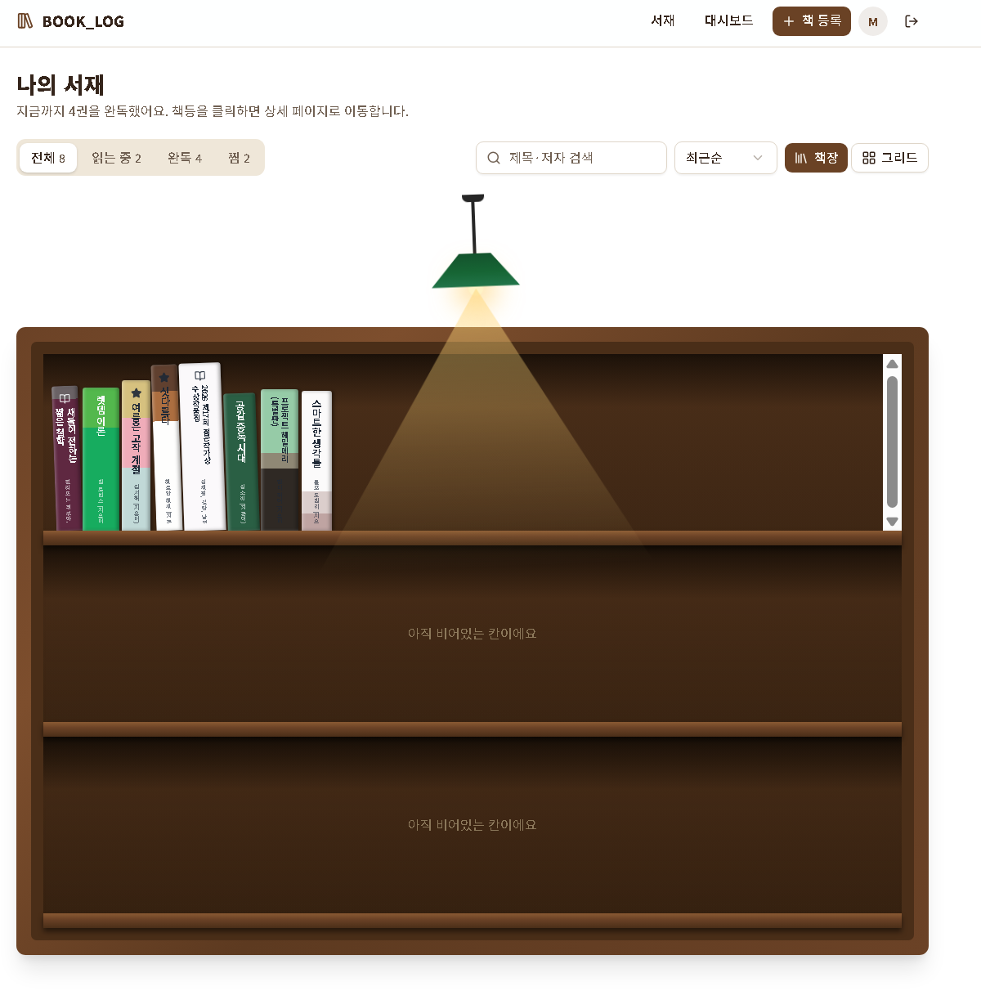
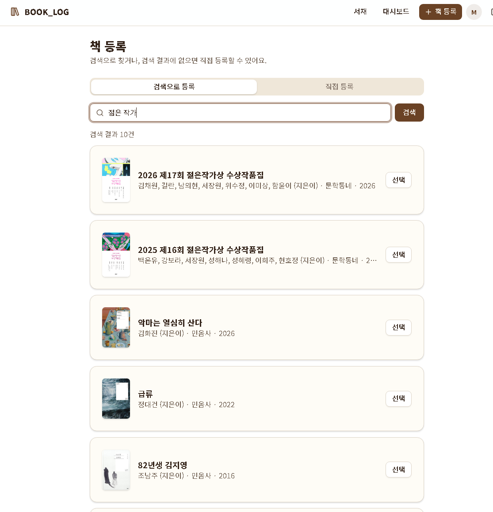
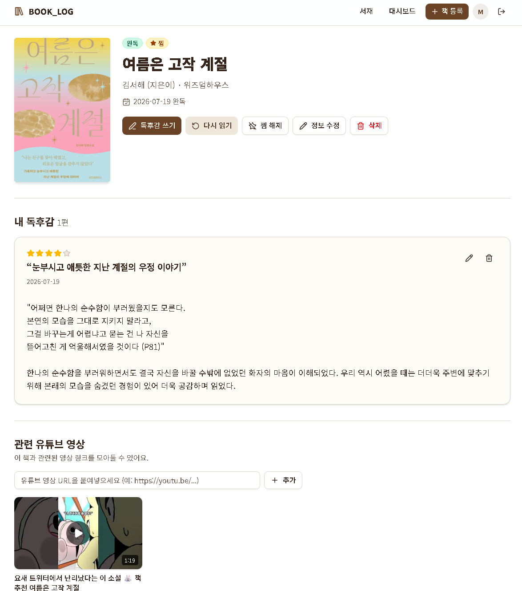
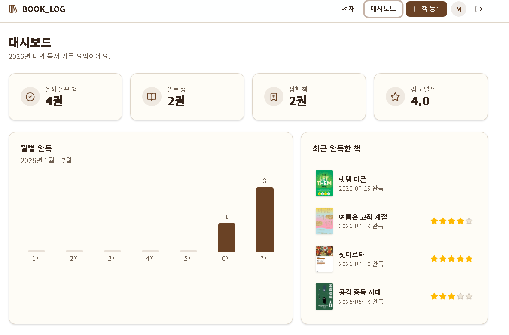

# 📚 BOOK_LOG

나만의 책장에 읽은 책을 꽂아두는 독서 기록 서비스입니다.
책을 등록하면 표지 색을 추출해 책등(spine)을 만들어 책장에 꽂아주고, 읽기 진행률·독후감·관련 유튜브 영상까지 한 곳에서 관리할 수 있습니다.

## 화면 미리보기

### 나의 서재

표지에서 추출한 색으로 만든 책등이 책장에 꽂힙니다. 상태(읽는 중 · 완독 · 찜) 필터, 제목·저자 검색, 정렬, 책장/그리드 보기 전환을 지원하고 책등을 클릭하면 상세 페이지로 이동합니다.



### 책 등록

알라딘 OpenAPI 검색으로 제목·저자·출판사·표지·쪽수를 자동으로 채워 등록합니다. 검색 결과에 없는 책은 직접 등록할 수도 있습니다.



### 책 상세 — 독후감과 관련 영상

상태 변경, 진행률 기록, 별점과 함께 독후감을 남길 수 있습니다. 유튜브 링크를 붙여넣으면 제목·채널·썸네일이 자동으로 채워지고, **완독 처리하면 조회수가 높은 리뷰 영상 1개를 자동으로 추천해 등록**해 줍니다.



### 대시보드

올해 읽은 책 수, 읽는 중·찜한 책, 평균 별점과 월별 완독 추이, 최근 완독한 책을 한눈에 보여줍니다.



## 주요 기능

- **책장 UI** — 표지 이미지에서 색 비율을 추출해 1~2색 책등을 생성, 실제 책장처럼 진열
- **책 등록** — 알라딘 검색 자동 채움 / 직접 등록, 상태(읽는 중 · 완독 · 찜)와 날짜 자동 기록
- **진행률 관리** — 현재 페이지 기록, 마지막 페이지 도달 시 자동 완독 처리
- **독후감** — 별점 · 한 줄 평 · 본문 작성, 수정/삭제
- **관련 유튜브 영상** — URL 등록 시 oEmbed로 메타데이터 자동 채움, 완독 시 조회수 1위 리뷰 영상 자동 추천
- **대시보드** — 연간 독서 통계와 월별 완독 차트
- **인증** — Supabase Auth 로그인, RLS로 사용자별 데이터 분리

Next.js 16 (App Router, Server Actions), React 19, TypeScript |

## 실행 방법

```bash
cd web
npm install
npm run dev
```

`web/.env.local`에 아래 환경 변수가 필요합니다.

```bash
NEXT_PUBLIC_SUPABASE_URL=
NEXT_PUBLIC_SUPABASE_PUBLISHABLE_KEY=
ALADIN_TTB_KEY=
YOUTUBE_API_KEY=
```

## 프로젝트 구조
